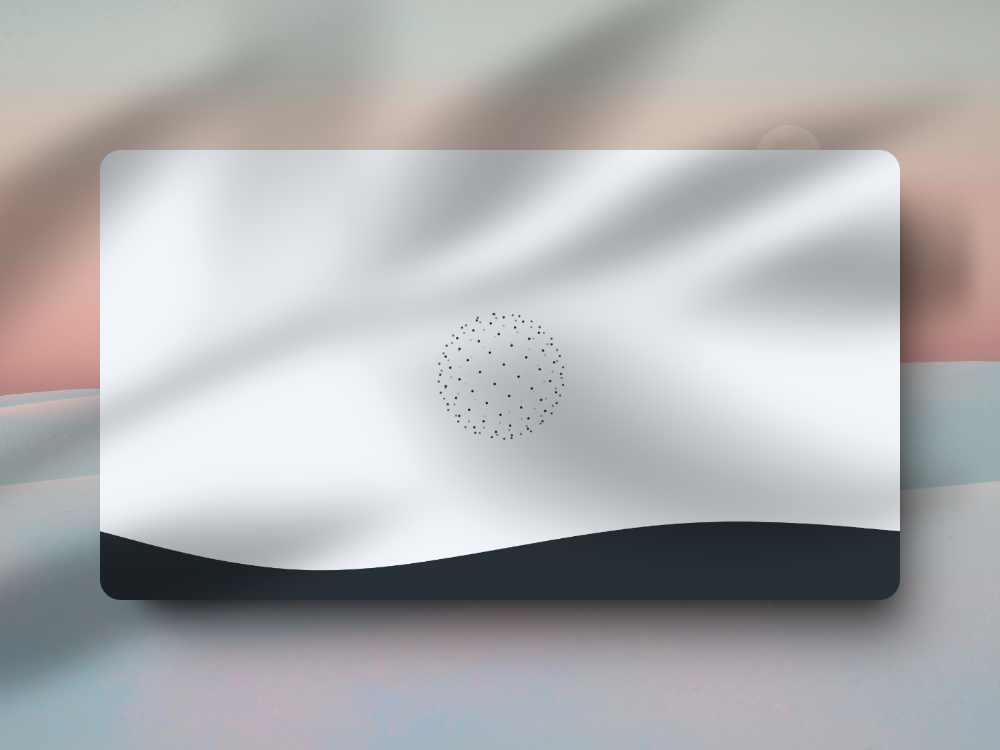

<h1 align="center">Esfera de puntos</h1>

<p align="center" >


</p>

<p align="center">Esfera de puntos con Typescript.</p>

Este proyecto es una implementación de un diseño interactivo de una esfera 3D creada utilizando TypeScript y React. La esfera está compuesta por puntos que se distribuyen uniformemente en su superficie y pueden moverse y rotar en respuesta a interacciones del usuario. Este repositorio no es un tutorial, sino una demostración del proceso de construcción de este efecto visual.



## Ejemplo de uso

```typescript
import { useEffect, useRef } from "react";
import { Sphere } from "./lib/sphere";

export function SphereComponent() {

    const canvas = useRef<HTMLDivElement>(null);

    useEffect(() => {
        const current = canvas.current;
        if (!current) return;

        // Create Sphere
        const sphere = new Sphere(current, 150);
        sphere.fps = 30;
        sphere.color = '#17181f'
        sphere.sizePoints = 3
        
        const destroySphere = sphere.createSphere();
        const cancelEvent = sphere.mouseSphere();
        const cancelRotate = sphere.rotateSphere();

        return () => {
            destroySphere();
            cancelEvent();
            cancelRotate();
        }
    }, [])


    return <div ref={canvas} className="w-[200px] h-[200px]"></div>
}
```

---

<p align="center">
  <a href="https://github.com/EddyBel" target="_blank">
    
  </a> 
  <a href="https://www.linkedin.com/in/eduardo-rangel-eddybel/" target="_blank">
    
  </a> 
</p>
